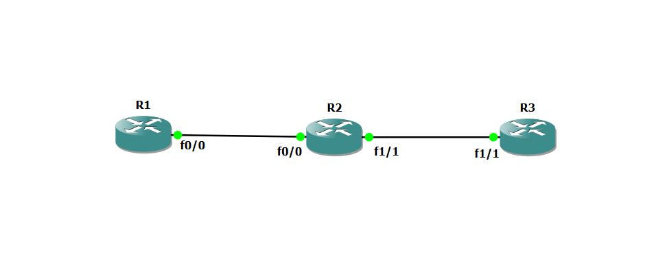

# ospf-multiarea-lab
OSPF multi-area network simulation using GNS3
# OSPF Multi-Area Lab


Simulasi jaringan OSPF multi-area menggunakan GNS3 dengan Cisco IOS. Lab ini mendemonstrasikan bagaimana OSPF membagi jaringan besar menjadi beberapa area untuk efisiensi routing, dengan Area 0 sebagai backbone.

---

## Topologi

> Screenshot topologi GNS3 (ganti gambar di bawah ini)



```
[R1] ------------------- [R2] ------------------- [R3]
      f0/0       f0/0          f1/1       f1/1
   192.168.12.1  192.168.12.2  192.168.23.1  192.168.23.2

|---- Area 0 (Backbone) ----|---- Area 2 -----------|
```

---

## Detail Device

| Device | Role | Interface | IP Address | Area |
|--------|------|-----------|------------|------|
| R1 | Internal Router | f0/0 | 192.168.12.1/24 | Area 0 |
| R2 | ABR (Area Border Router) | f0/0 | 192.168.12.2/24 | Area 0 |
| R2 | ABR (Area Border Router) | f1/1 | 192.168.23.1/24 | Area 2 |
| R3 | Internal Router | f1/1 | 192.168.23.2/24 | Area 2 |

---

## Konfigurasi

Semua file konfigurasi ada di folder `configs/`:

- [`configs/R1.txt`](configs/R1.txt) — Internal router Area 0
- [`configs/R2.txt`](configs/R2.txt) — ABR penghubung Area 0 dan Area 2
- [`configs/R3.txt`](configs/R3.txt) — Internal router Area 2

---

## Cara Reproduksi Lab Ini

### Requirements
- GNS3 versi 2.x ke atas
- Cisco IOS image (c7200 atau c3725)
- RAM minimal 4GB

### Langkah-langkah

1. Clone repo ini
   ```bash
   git clone git@github.com:zkizen/ospf-multiarea-lab.git
   ```

2. Buka GNS3 → **File → New blank project** → beri nama `ospf-multiarea-lab`

3. Tambahkan 3 router Cisco ke canvas dan hubungkan sesuai topologi di atas

4. Jalankan semua router, buka console masing-masing

5. Copy-paste config dari folder `configs/` ke tiap router sesuai namanya

6. Verifikasi OSPF berjalan:
   ```
   show ip ospf neighbor
   show ip route
   ```

---

## Verifikasi & Hasil

### OSPF Neighbor Table (R2 sebagai ABR)
```
Neighbor ID     Pri   State           Dead Time   Address         Interface
192.168.12.1      1   FULL/DR         00:00:35    192.168.12.1    FastEthernet0/0
192.168.23.2      1   FULL/BDR        00:00:35    192.168.23.2    FastEthernet1/1
```

### Routing Table R3 (bukti inter-area route berhasil)
```
O IA  192.168.12.0/24 [110/2] via 192.168.23.1, FastEthernet1/1
C     192.168.23.0/24 is directly connected, FastEthernet1/1
```

> Screenshot hasil `show ip route` dan `show ip ospf neighbor` ada di folder `screenshots/`

---

## Konsep yang Dipelajari

- **OSPF Area** — pembagian jaringan menjadi area untuk mengurangi flooding LSA
- **Area 0 (Backbone)** — area wajib yang menghubungkan semua area lain
- **ABR (Area Border Router)** — router yang berada di lebih dari satu area (R2)
- **Inter-area routing** — route bertipe `O IA` yang melewati ABR antar area
- **DR/BDR Election** — pemilihan Designated Router di jaringan multi-access

---

## Struktur Folder

```
ospf-multiarea-lab/
├── README.md
├── configs/
│   ├── R1.txt
│   ├── R2.txt
│   └── R3.txt
└── screenshots/
    ├── topology.png
    ├── ospf-neighbor-R2.png
    └── ip-route-R3.png
```

---

## Author

**Muhammad Zaki Zein** — [@zkizen](https://github.com/zkizen)  
SMK TKJ Graduate ·
